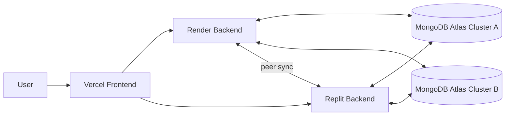

# Distributed System Overview

## What is distributed

- **Vercel** hosts the frontend
- **Render** runs backend node 1
- **Replit** runs backend node 2
- **MongoDB Atlas Cluster A** and **MongoDB Atlas Cluster B** store the data

The frontend talks to one active backend at a time. Each backend can talk to both MongoDB clusters.

## Architecture



## How requests are routed

- `VITE_API_BASE_URL` is the primary backend
- `VITE_FALLBACK_API_URL` is the backup backend
- the frontend stores the current backend in `sessionStorage`
- if the active backend fails, the frontend rotates to the other server

Main client files:
- [client/src/utils/networkConfig.js](client/src/utils/networkConfig.js)
- [client/src/store/slices/apiSlice.js](client/src/store/slices/apiSlice.js)
- [client/src/App.jsx](client/src/App.jsx)

```js
const PEER_NODES = [PRIMARY_URL, FALLBACK_URL].filter(Boolean);
const active = getActiveBackendUrl();
```

## Example flow: user register

This is the easiest way to see the system working.

### 1. Frontend submits the request

File:
- [client/src/pages/RegisterScreen.jsx](client/src/pages/RegisterScreen.jsx)

```js
const [register] = useRegisterMutation();

const submitHandler = async (e) => {
  e.preventDefault();
  const res = await register({ name, email, password }).unwrap();
  dispatch(setCredentials({ ...res }));
  navigate(redirect);
};
```

### 2. RTK Query sends it to the active backend

File:
- [client/src/store/slices/usersApiSlice.js](client/src/store/slices/usersApiSlice.js)

```js
register: builder.mutation({
  query: (data) => ({
    url: '/api/users/register',
    method: 'POST',
    body: data,
  }),
}),
```

### 3. Backend route receives it

File:
- [server/routes/userRoutes.js](server/routes/userRoutes.js)

```js
router.post('/register', registerUser);
```

### 4. Backend controller writes to MongoDB

File:
- [server/controllers/authController.js](server/controllers/authController.js)

```js
const user = await User.create({ name, email, password });
res.status(201).json({
  _id: user._id,
  name: user.name,
  email: user.email,
  token: generateToken(user._id),
});
```

### 5. Sync and failover logic keep the system alive

- if Render is down, the frontend rotates to Replit
- if Replit is down, the frontend rotates to Render
- if one Mongo cluster is down, the backend stores pending sync work in `SyncQueue`
- when the offline cluster returns, queued work is replayed

## How backend failover works

- the frontend keeps one active backend URL
- request errors and socket errors can trigger backend rotation
- image URLs are rebuilt against the active backend

Main files:
- [client/src/utils/mediaUrl.js](client/src/utils/mediaUrl.js)
- [client/src/utils/networkConfig.js](client/src/utils/networkConfig.js)
- [client/src/store/slices/apiSlice.js](client/src/store/slices/apiSlice.js)

```js
export const getActiveBackendUrl = () => {
  let active = sessionStorage.getItem('activeBackendUrl');
  if (!active || !PEER_NODES.includes(active) || !isNodeHealthy(active)) {
    active = getPreferredBackendUrl();
    sessionStorage.setItem('activeBackendUrl', active);
  }
  return active;
};
```

## How database sync works

Main backend files:
- [server/config/db.js](server/config/db.js)
- [server/models/syncQueueModel.js](server/models/syncQueueModel.js)
- [server/config/connectionManager.js](server/config/connectionManager.js)
- [server/utils/peerSync.js](server/utils/peerSync.js)

Behavior:
- both clusters are connected from the backend
- updates are applied to the available cluster
- failed mirror operations are stored in `SyncQueue`
- the queue is locked so Render and Replit do not replay the same task twice

```js
if (clusterBOffline) {
  await SyncQueue.create({ op, payload, status: 'pending' });
} else {
  await applyToClusterA();
  await applyToClusterB();
}
```

### When Cluster B is offline

- the app keeps working on the live cluster
- the failed operation is queued
- queue items stay pending until Cluster B returns

### When Cluster B reconnects

- the reconnect watcher notices the healthy cluster
- queued items are claimed and replayed
- after success, the item is cleared from the queue

## Why this architecture helps

- **Availability**: the app can keep serving traffic if one backend goes down
- **Redundancy**: data is mirrored across two MongoDB Atlas clusters
- **Fault tolerance**: queued replay protects against temporary outages
- **Operational continuity**: the frontend can fail over without a full stop

## Important code files

- [client/src/pages/RegisterScreen.jsx](client/src/pages/RegisterScreen.jsx)
- [client/src/store/slices/usersApiSlice.js](client/src/store/slices/usersApiSlice.js)
- [client/src/utils/networkConfig.js](client/src/utils/networkConfig.js)
- [client/src/utils/mediaUrl.js](client/src/utils/mediaUrl.js)
- [server/routes/userRoutes.js](server/routes/userRoutes.js)
- [server/controllers/authController.js](server/controllers/authController.js)
- [server/config/db.js](server/config/db.js)
- [server/models/syncQueueModel.js](server/models/syncQueueModel.js)
- [server/config/connectionManager.js](server/config/connectionManager.js)
- [server/utils/peerSync.js](server/utils/peerSync.js)

## Libraries used

These packages make the distributed behavior work:

- `socket.io` and `socket.io-client` for realtime server-to-client and peer event sync
- `@reduxjs/toolkit` for RTK Query and shared API state
- `axios` for Chapa and other backend HTTP calls
- `mongoose` for MongoDB models and dual-cluster persistence
- `multer` for file upload handling
- `cloudinary` for shared image storage
- `cors`, `dotenv`, `express`, and `jsonwebtoken` for the API layer and auth flow

## Note

This is a practical distributed design with backend failover, dual MongoDB sync, and queue replay. It is not full multi-master consensus replication.
